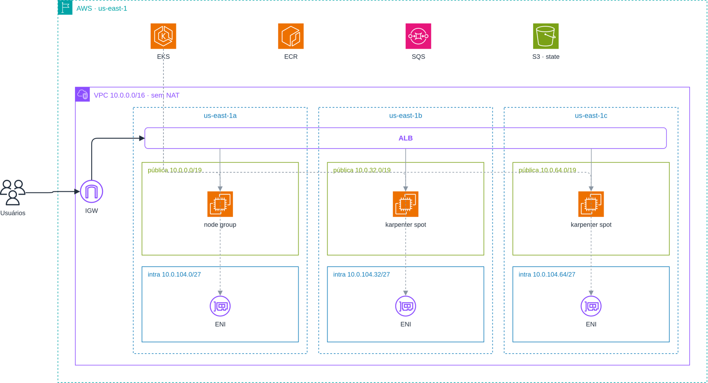
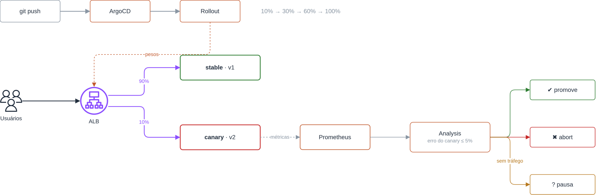

# argo-rollouts

Lab de canary com Argo Rollouts no EKS: o ALB divide o tráfego, o Prometheus mede a taxa de erro do canary e o Rollout promove ou volta sozinho.





## Subir e derrubar

```bash
./scripts/lab-up.sh     # infra, imagem, ArgoCD e apps
./scripts/lab-down.sh   # derruba o que cobra por hora; mantém VPC, ECR e state
```

## Estrutura

```text
app/      app de exemplo (Go)
infra/    Terragrunt: vpc, eks, karpenter, lb-controller, ecr
gitops/   ArgoCD (app of apps) e manifests do demo
scripts/  lab-up / lab-down
docs/     diagramas (abrem no draw.io)
```
